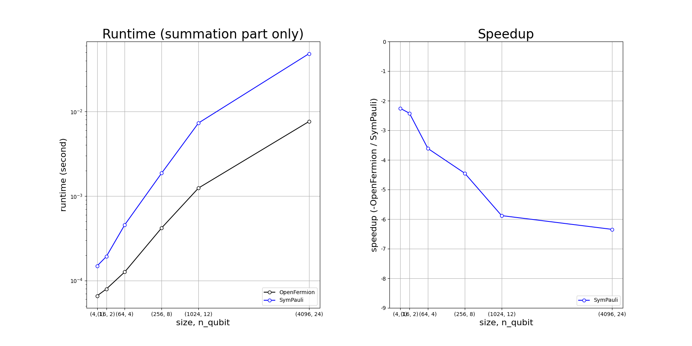
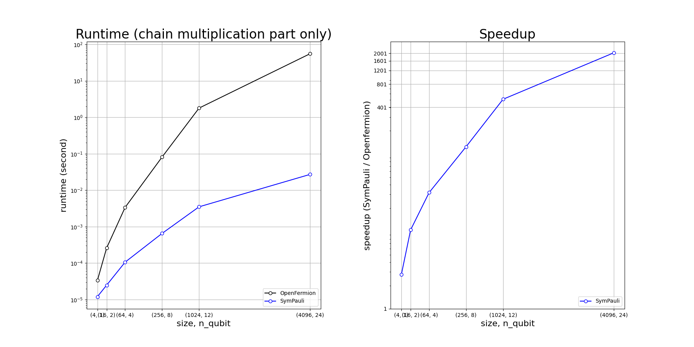
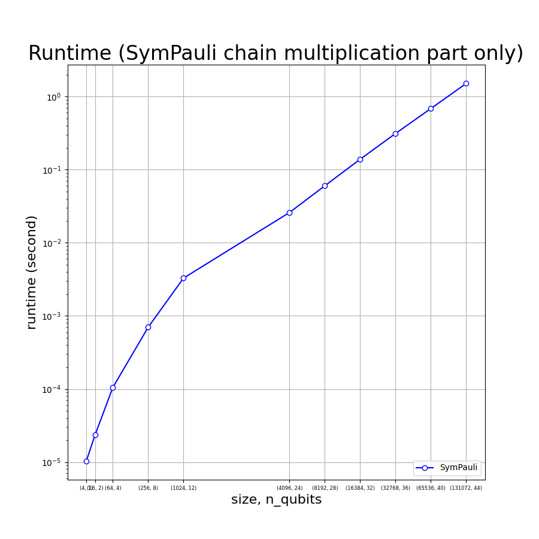

# SymPauli
Symbolic Pauli Operator Multiplication

Super parallelism implemented using relational data structure that acceralate chain multiplication of Pauli Matrix Tensors by 40000X in 40 qubits simulation.

All rights reserved.

# Explained

Explained in link below.

<https://hirasawakinko.github.io/chika_home/toward_science/Qubit%20Matrix%20Chain%20Multiplication%20in%20O(n)/>

# Benchmark Result

## environment: 
  - Python3.10 
  - Numpy-intel-mkl
  - Jupyterlab3.4.7 
  - AMD Ryzen7 5700G
  - DDR4 64GB 3200MHz CL22

