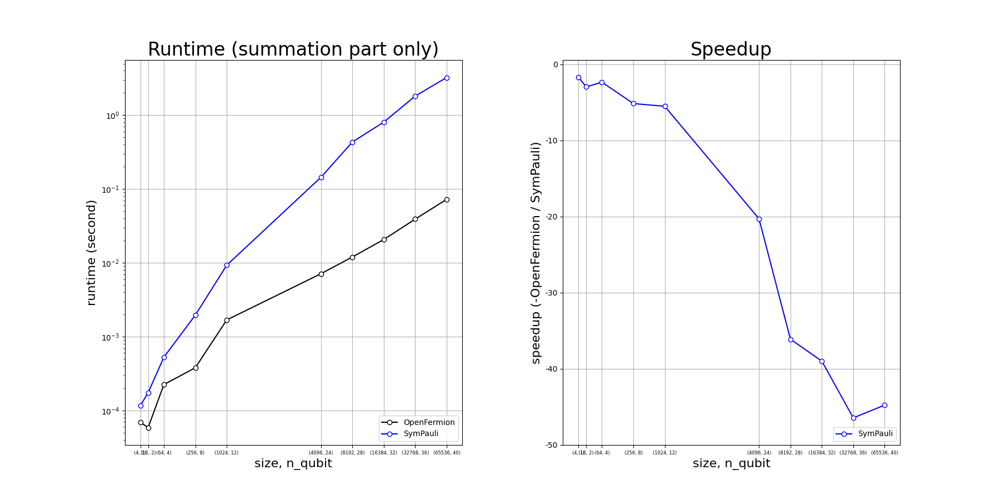
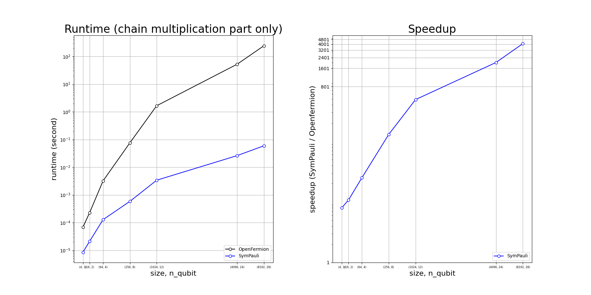

# SymPauli
Symbolic Pauli Operation Multiplication

Super parallelism implemented by relational data structure that acceralate chain multiplication of Pauli Matrix Tensors by 40000X in 40 qubits simulation.

All rights reserved.

# Benchmark Result

## environment: 
  - Python3.10 
  - Jupyterlab3.4.7 
  - AMD Ryzen7 5700G
  - DDR4 64GB 3200MHz CL22

